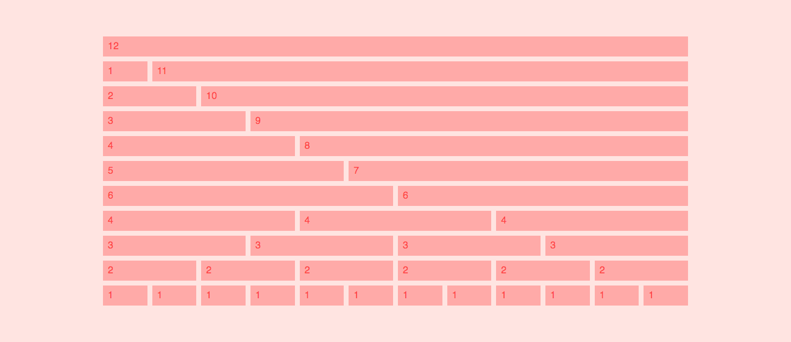
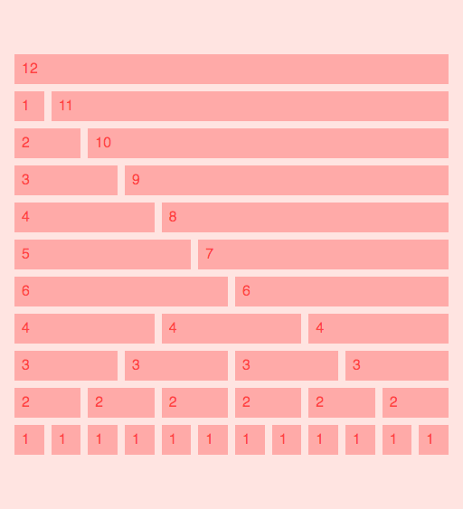

# Design Grid with CSS Grid

Designers use the concept of grid to create beatiful and well organized layouts.

There are many frameworks (like Bootstrap for example) that let us apply this concept in code.

Let's create our own design grid representation by using CSS grid.

Desktop:



Mobile:



## Make it responsive

```html
<div class="col-12 col-m-8 col-lg-6"></div>
```